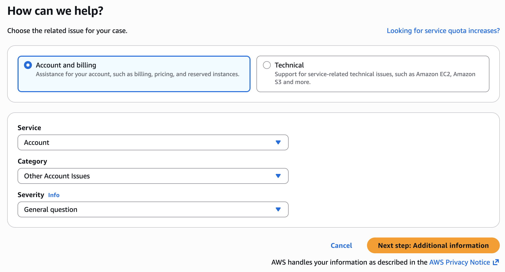
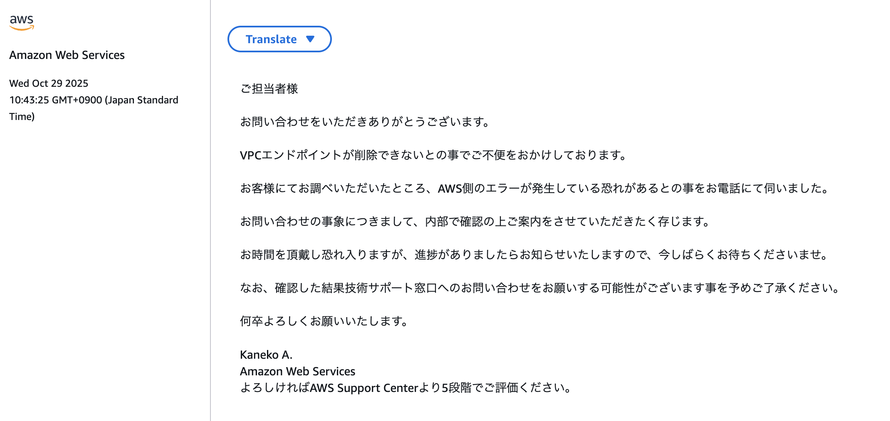
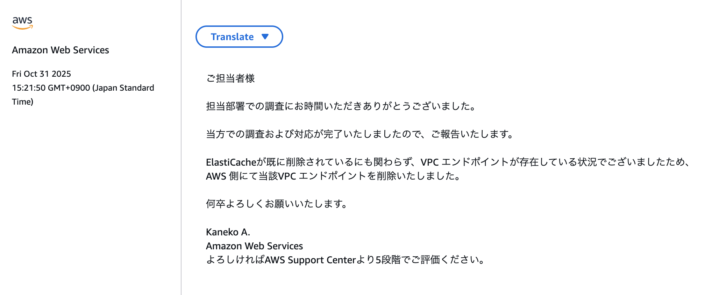
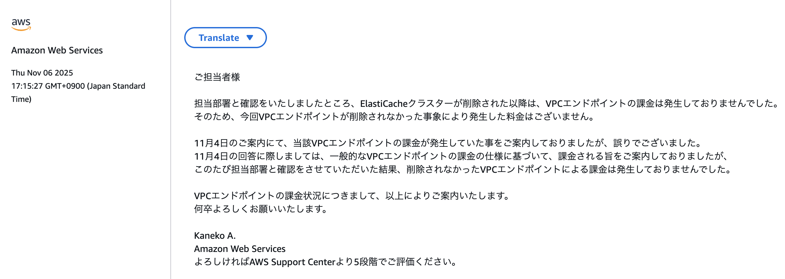

# 障害内容

ElastiCache Serverlessを含めるIaCをCloudFormationにデプロイしたスタックがあります。

テスト終了後、スタックを削除する際に、エラーが発生しました。

確認したところ、削除できないものはVPCでした。VPCが削除できない理由は、ElastiCache VPC EndpointがVPCに依存しているためです。

ElastiCache Endpointを手動で削除しようとしましたが、AWSの仕様により、ユーザーが手動で削除できるものではないです。

```
vpce-046418ae14aad1ea0 - Operation is not allowed for requester-managed VPC endpoints for the service
com.amazonaws.elasticache.serverless.ap-northeast-3.vpce-svc-0f88c433e3937fddc.
```

本来であれば、ElastiCacheが削除されると、関連するEndpointも一緒に削除されるものです。（通常は数分間でクリアされますが、最大24時間がかかりそうです）

# 解決手順

色々調べてみたら、AWS側の障害らしく、数日間待ってもクリアされないため、サポートセンターに削除依頼を出すしかないです。

[re:Post記事](https://repost.aws/questions/QUEA6zo2e2RkyA97b3QJ2DUg/i-would-like-to-know-how-to-delete-vpc-endpoints-that-remain-after-deleting-a-serverless-cache-in-aws-elasticache)

これはAWS側の障害なので、【Technical】カテゴリーから依頼を出す必要なく、無料の**Basic Plan**で【Account and billing】カテゴリーから問い合わせしましょう。



該当現象を記載した上で、上記re:Post記事のリンクも一緒に入れましょう。

僕の場合、最初に発生現象だけを記載したのですが、AWS担当からの折り返し電話に、テクニカルサポートの範囲だと言われて、有料対応になりそうな雰囲気でした。
その場でre:Post記事にはAWS側の障害だとはっきり伝えてから、担当部署に連携してみるとの返事でした。なので、最初にre:Post記事も一緒に入れたほうが良いと思います。



数日後、AWSサポートチームがEndpointを削除してくれました。



料金について、ElastiCache Endpointは【Interface】タイプなので、3つが作られており、高額の料金が取られてしまう可能性があります。

問い合わせしてみた結果、料金が発生していないようです。



これで問題がすべて解決できました。ハッピーエンドです。
